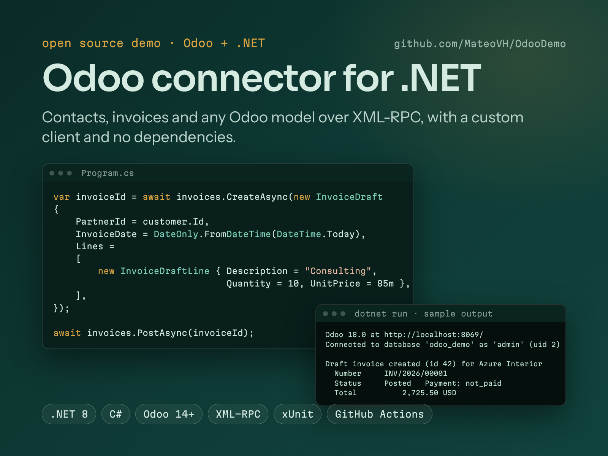
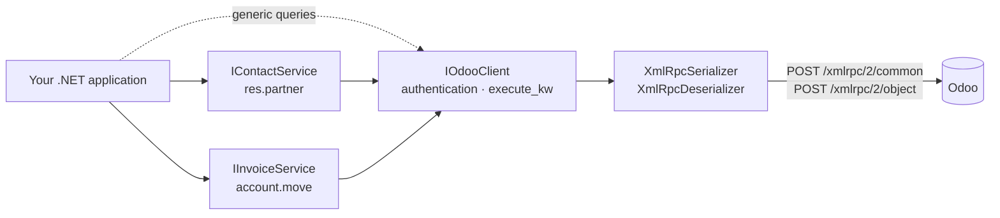

# OdooConnector · Odoo connector for .NET

[Español](README.md) · **English**

[](https://github.com/MateoVH/OdooDemo/actions/workflows/ci.yml)


[](LICENSE)

A **.NET 8** library that connects applications to **Odoo** through its external **XML-RPC** API. It reads contacts (`res.partner`), creates and posts invoices (`account.move`) and queries any model with a typed domain builder.

The XML-RPC client is written from scratch on top of `HttpClient` and `System.Xml`, with no third-party libraries. Error messages are available in **English and Spanish**.



## Contents

- [Features](#features)
- [Architecture](#architecture)
- [Requirements](#requirements)
- [Quick start](#quick-start)
- [Without dependency injection](#without-dependency-injection)
- [Any model](#any-model)
- [Error handling](#error-handling)
- [Languages: English and Spanish](#languages-english-and-spanish)
- [Running the demo](#running-the-demo)
- [Tests](#tests)
- [Design decisions](#design-decisions)
- [Compatibility and the future of XML-RPC](#compatibility-and-the-future-of-xml-rpc)
- [Project layout](#project-layout)

## Features

- **Contacts**: search by text, company or individual, and country, with paging, counting and lookup by id (archived contacts included).
- **Invoices**: create customer or vendor invoices and credit notes with all their lines in a single call. Post them (`action_post`) and read them back with the totals Odoo computed.
- **Any model**: `search_read`, `search_count`, `read`, `create`, `write`, `unlink`, and `execute_kw` for everything else.
- **`OdooDomain`**: domains written as in Python (`[('is_company', '=', True)]`) and combined with `And`, `Or` and `Not`.
- **`OdooRecord`**: understands Odoo's conventions. `False` means empty, a many2one comes as `[id, "name"]` and dates come as strings.
- **Production ready**:
  - `AddOdooConnector` integrates the library with `IServiceCollection` and `IHttpClientFactory`.
  - Settings are validated at startup.
  - Logging goes through `ILogger`.
  - Errors are typed exceptions.
- **Secure by default**:
  - XML is parsed with DTDs disabled, which blocks XXE and *billion laughs* attacks.
  - The API key never shows up in logs or exceptions.

## Architecture



## Requirements

- **.NET 8 or later** in the application that uses the library. It targets `net8.0`, so it also runs on .NET 9 and 10.
- **.NET 10 SDK** to build the solution (`.slnx`) and run the tests.
- **Odoo 14 or later**. Invoices require the Invoicing or Accounting app.

## Quick start

### 1. Create an API key in Odoo

1. Sign in to Odoo as the user the integration will act as.
2. Open your profile from the user menu: *Preferences* in Odoo 17 and 18, *My Preferences* from Odoo 19 on.
3. On the *Account Security* tab (*Security* from Odoo 19 on), create a new API key.

The API key replaces the password in the calls. Keep in mind:

- If the user has two-factor authentication enabled, only API keys work.
- Since Odoo 18, keys can expire (90 days at most by default for internal users).
- Ideally, use a dedicated integration user with the minimum permissions.

### 2. Configure the connection

`appsettings.json`:

```json
{
  "Odoo": {
    "Url": "https://mycompany.odoo.com",
    "Database": "mycompany",
    "Username": "integrations@mycompany.com"
  }
}
```

Keep the API key out of the repository. Store it with *user-secrets* or in an environment variable:

```bash
dotnet user-secrets set "Odoo:ApiKey" "<your-api-key>"
```

```bash
export Odoo__ApiKey="<your-api-key>"
```

### 3. Register the connector

```csharp
builder.Services.AddOdooConnector(builder.Configuration.GetSection("Odoo"));
```

This registers `IOdooClient`, `IContactService` and `IInvoiceService` as singletons. If a setting is missing, the application fails at startup with a clear message.

### 4. Read contacts

```csharp
public sealed class CustomerReport(IContactService contacts)
{
    public async Task PrintAsync(CancellationToken cancellationToken)
    {
        var query = new ContactQuery { IsCompany = true, CountryCode = "US", Search = "inc", Limit = 20 };

        var total = await contacts.CountAsync(query, cancellationToken);
        var companies = await contacts.SearchAsync(query, cancellationToken);

        Console.WriteLine($"{companies.Count} of {total} companies");
        foreach (var company in companies)
        {
            Console.WriteLine($"{company.Id} · {company.Name} · {company.TaxId ?? "no tax id"} · {company.Email ?? "no email"}");
        }
    }
}
```

When a field is empty in Odoo, it comes back as `null`, never as the string `"False"`.

### 5. Create and post an invoice

```csharp
var invoiceId = await invoices.CreateAsync(new InvoiceDraft
{
    PartnerId = customer.Id,
    InvoiceDate = DateOnly.FromDateTime(DateTime.Today),
    Reference = "PO-1001",
    Lines =
    [
        new InvoiceDraftLine { Description = "Functional consulting (hours)", Quantity = 10, UnitPrice = 85m },
        new InvoiceDraftLine { ProductId = 5, Quantity = 2, Discount = 10 },
    ],
});

await invoices.PostAsync(invoiceId);

var invoice = await invoices.GetByIdAsync(invoiceId);
Console.WriteLine($"{invoice!.Number}: {invoice.AmountTotal:N2} {invoice.Currency?.Name}");
```

- The invoice is created as a draft. `PostAsync` posts it and Odoo assigns its number.
- Optional values you leave out are not sent, so Odoo computes them from the product: the second line takes the price, taxes and account of product 5.
- `TaxIds = []` creates the line without taxes. Leave it `null` to let Odoo apply the default taxes.

## Without dependency injection

```csharp
using var http = new HttpClient();

var odoo = new OdooClient(http, new OdooOptions
{
    Url = new Uri("https://mycompany.odoo.com"),
    Database = "mycompany",
    Username = "integrations@mycompany.com",
    ApiKey = Environment.GetEnvironmentVariable("ODOO_API_KEY") ?? "",
});

var contacts = new ContactService(odoo);
var invoices = new InvoiceService(odoo);
```

Reuse the same `OdooClient` instance. It is thread-safe and authenticates only once.

## Any model

`IOdooClient` exposes Odoo's ORM for the models that have no typed service:

```csharp
// (A and B) and (C or D): sent in the prefix (Polish) notation Odoo uses.
var domain = OdooDomain.Where("move_type", "=", "out_invoice")
    .And("state", "=", "posted")
    .And(OdooDomain.Where("payment_state", "=", "not_paid").Or("payment_state", "=", "partial"));

Console.WriteLine(domain);
// ['&', '&', ('move_type', '=', 'out_invoice'), ('state', '=', 'posted'), '|', ('payment_state', '=', 'not_paid'), ('payment_state', '=', 'partial')]

var pending = await odoo.SearchReadAsync(
    "account.move",
    domain,
    fields: ["name", "partner_id", "amount_residual", "invoice_date_due"],
    limit: 50,
    order: "invoice_date_due asc");

foreach (var record in pending)
{
    var customer = record.GetReference("partner_id");  // many2one -> OdooReference(Id, Name), or null
    var dueDate = record.GetDate("invoice_date_due");  // DateOnly?
    Console.WriteLine($"{record.GetString("name")} · {customer?.Name} · {record.GetDecimal("amount_residual"):N2} · {dueDate}");
}
```

To create or update records, and to call any other method:

```csharp
var partnerId = await odoo.CreateAsync("res.partner", new Dictionary<string, object?>
{
    ["name"] = "New Customer Inc.",
    ["is_company"] = true,
    ["category_id"] = new[] { OdooCommand.Link(3) },  // many2many: Odoo's Command.link(3)
});

await odoo.ExecuteKwAsync(
    "res.partner",
    "message_post",
    [new[] { partnerId }],
    new Dictionary<string, object?> { ["body"] = "Customer created from .NET" });
```

`OdooCommand` mirrors Odoo's `Command` class: `Create`, `Update`, `Delete`, `Unlink`, `Link`, `Clear` and `Set`.

## Error handling

| Exception | When it is thrown |
|---|---|
| `OdooAuthenticationException` | The database, username or API key is wrong, or the API key expired. |
| `OdooFaultException` | Odoo processed the call and returned an error. `Kind` tells the category. |
| `OdooException` | Network, HTTP, timeout or non-XML-RPC response. It is the base class of the other two. |
| `ArgumentException` | Incomplete data caught before calling Odoo, e.g. an invoice without lines. |

`OdooFaultException.Kind` takes these values:

| Value | Meaning |
|---|---|
| `UserError` | A business rule (`UserError`, `ValidationError`…). The message is meant for end users. |
| `AccessError` | The user is not allowed to perform the operation. |
| `ServerError` | An unexpected server error. `Message` summarizes the last line of the traceback and `FaultString` has all of it. |

```csharp
try
{
    await invoices.PostAsync(invoiceId);
}
catch (OdooFaultException ex) when (ex.Kind == OdooFaultKind.UserError)
{
    logger.LogWarning("Odoo rejected invoice {InvoiceId}: {Reason}", invoiceId, ex.Message);
}
```

The library **does not retry** calls on its own, because a `create` retried after a timeout can duplicate an invoice. `AddOdooConnector` returns the `IHttpClientBuilder`, so you can tune the `HttpClient` as you need:

```csharp
builder.Services.AddOdooConnector(builder.Configuration.GetSection("Odoo"))
    .ConfigureHttpClient(http => http.Timeout = TimeSpan.FromSeconds(30));
```

## Languages: English and Spanish

The library's messages are in English and Spanish, in standard .NET resource files (`Resources/Strings.resx` and `Strings.es.resx`).

- The language follows `CultureInfo.CurrentUICulture`: any `es-*` culture (es-CO, es-MX, es-ES…) uses Spanish and every other culture uses English.
- To pin a language in your application:

  ```csharp
  CultureInfo.DefaultThreadCurrentUICulture = new CultureInfo("en");
  ```

- The console demo accepts `--lang en` or `--lang es`. Without that option, it uses the system language.
- A test checks that every message exists in both languages with the same placeholders.

Business errors raised by Odoo itself (`UserError`) arrive in the language configured for the user in Odoo.

## Running the demo

The [`samples/OdooConnector.Sample`](samples/OdooConnector.Sample) folder contains a console app that shows the server version, lists companies and, on request, creates an invoice.

**1. Start a local Odoo** (Odoo 18 + PostgreSQL) with the included [`docker-compose.yml`](docker-compose.yml):

```bash
docker compose up -d
```

**2. Prepare the database**:

1. Open http://localhost:8069.
2. Create a database named `odoo_demo` and tick the demo data option.
3. Install the **Invoicing** app.
4. Create an API key for your user. On a local setup the password works too.

**3. Run the demo**. The demo's `appsettings.json` already points to `http://localhost:8069`, the `odoo_demo` database and the `admin` user; if you used another login when creating the database, change `Odoo:Username`. Only the API key is missing:

```bash
dotnet user-secrets set "Odoo:ApiKey" "<your-api-key>" --project samples/OdooConnector.Sample
```

Read only:

```bash
dotnet run --project samples/OdooConnector.Sample -- --lang en
```

Create and post a test invoice:

```bash
dotnet run --project samples/OdooConnector.Sample -- --lang en --create-invoice --post
```

`--verbose` logs every RPC call with its duration.

Sample output (the data depends on your database):

```text
Odoo 18.0 at http://localhost:8069/
Connected to database 'odoo_demo' as 'admin' (uid 2)

Companies (3 of 3):
     ID  Name                             Email                            Country
     14  Azure Interior                   azure.Interior24@example.com     United States
     30  Deco Addict                      deco.addict82@example.com        United States
      1  My Company                       info@yourcompany.com             United States

Draft invoice created (id 42) for Azure Interior
  Number     INV/2026/00001
  Status     Posted   Payment: not_paid
  - Odoo functional consulting (hours)           12 x      85.00 =   1,020.00
  - .NET ↔ Odoo integration via XML-RPC           1 x   1,500.00 =   1,350.00
  Untaxed        2,370.00 USD
  Taxes            355.50 USD
  Total          2,725.50 USD
```

## Tests

```bash
dotnet test
```

- **Unit tests**: no network and no Odoo needed.
  - The services are tested against an in-memory fake Odoo server (an `HttpMessageHandler`). It decodes and records every XML-RPC request, and the tests compare what was sent in Python notation, just like in Odoo: `[['&', ['is_company', '=', True], ['country_id.code', '=', 'CO']]]`.
  - The parser is tested with responses generated by Python's `xmlrpc` module, the same one Odoo uses to write its responses.
  - HTTP errors, timeouts, cancellation, malicious XML, number cultures (`es-CO` uses a decimal comma) and concurrent authentication are covered as well.
- **Integration tests**: run against a real Odoo only when you opt in, and they **write data**: they create a contact and a draft invoice, then delete both. Point them at a test database:

  ```bash
  export ODOO_INTEGRATION_TESTS=1
  export ODOO__URL=http://localhost:8069 ODOO__DATABASE=odoo_demo ODOO__USERNAME=admin ODOO__APIKEY=<api-key>
  dotnet test
  ```

The GitHub Actions workflow builds, runs the tests and produces the NuGet package on every push.

## Design decisions

- **Own XML-RPC client.** Modern .NET has no XML-RPC support, and the alternatives are mostly ports of XML-RPC.NET, a .NET Framework library built on reflection-generated proxies. Writing one takes few lines, adds no dependencies and lets the client follow Odoo's quirks: dates as strings, `<nil/>` and `<i8>`.
- **Authenticate once.**
  - Odoo's XML-RPC API is stateless: every call carries the database, the uid and the API key.
  - The uid is requested once. Concurrent calls share that request, and a failure is retried on the next call.
  - The client is a singleton that asks `IHttpClientFactory` for an `HttpClient` on every call, so connection rotation keeps working.
- **`False` is not a string.** Odoo returns `False` for any empty field. `OdooRecord` turns it into `null`, `[]` or `0` depending on the field type.
- **Amounts as `decimal`.** Odoo sends them as `double`. They are converted to `decimal` with 15 significant digits, so `99.99` arrives as `99.99m`.
- **Validate before calling.** An incomplete `InvoiceDraft` fails without touching the network. Optional values are left out so Odoo can compute them.
- **Invariant culture on the wire.** Numbers and dates are always written the same way, whatever the machine's regional settings.

## Compatibility and the future of XML-RPC

- The library uses the `/xmlrpc/2/common` and `/xmlrpc/2/object` endpoints, and the `move_type` invoice field (available since Odoo 14).
- Every field the library reads exists in Odoo 17, 18, 19 and 20. Fields that changed between versions are avoided, such as `res.partner`'s `mobile`, which was removed in Odoo 18.2.
- **Odoo 19 deprecated XML-RPC and JSON-RPC.** The official documentation announces their removal in Odoo 22 (fall 2028) and Odoo Online 21.1 (winter 2027). The replacement is the [JSON-2 API](https://www.odoo.com/documentation/19.0/developer/reference/external_api.html) (`POST /json/2/<model>/<method>` with the API key as a *bearer* token). The transport is isolated in `OdooClient`, so adding JSON-2 behind the same interface is the natural next step.
- Since Odoo 19, XML-RPC is provided by the `rpc` module, which is installed by default. If someone uninstalls it, calls return 404.
- On **Odoo Online**, access to the external API requires the *Custom* plan.

## Project layout

```text
OdooDemo/
├── src/OdooConnector/             The library
│   ├── OdooClient.cs              Transport, authentication and generic ORM methods
│   ├── OdooDomain.cs              Domain builder
│   ├── OdooRecord.cs              Typed record access
│   ├── Contacts/                  IContactService (res.partner)
│   ├── Invoices/                  IInvoiceService (account.move)
│   ├── XmlRpc/                    XML-RPC serializer and parser
│   ├── Resources/                 English and Spanish messages (.resx)
│   └── DependencyInjection/       AddOdooConnector
├── tests/OdooConnector.Tests/     xUnit v3: unit and opt-in integration tests
├── samples/OdooConnector.Sample/  Console demo
├── docker-compose.yml             Odoo + PostgreSQL for local testing
└── .github/workflows/ci.yml       Build, tests and NuGet package
```

## License

[MIT](LICENSE).

Independent demo project, not affiliated with Odoo S.A. "Odoo" is a trademark of Odoo S.A.
