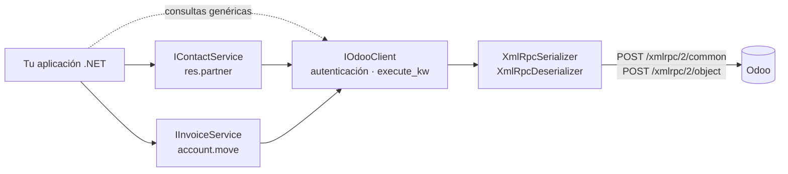

# OdooConnector · Conector Odoo para .NET

**Español** · [English](README.en.md)

[](https://github.com/MateoVH/OdooDemo/actions/workflows/ci.yml)


[](LICENSE)

Librería para **.NET 8** que integra aplicaciones con **Odoo** a través de su API externa **XML-RPC**: lee contactos (`res.partner`), crea y publica facturas (`account.move`) y consulta cualquier modelo con un constructor de dominios tipado.

El cliente XML-RPC está escrito desde cero sobre `HttpClient` y `System.Xml`, sin librerías de terceros. Los mensajes de error están en **español e inglés**.

## Contenido

- [Características](#características)
- [Arquitectura](#arquitectura)
- [Requisitos](#requisitos)
- [Inicio rápido](#inicio-rápido)
- [Uso sin inyección de dependencias](#uso-sin-inyección-de-dependencias)
- [Acceso a cualquier modelo](#acceso-a-cualquier-modelo)
- [Manejo de errores](#manejo-de-errores)
- [Idiomas: español e inglés](#idiomas-español-e-inglés)
- [Probar la demo](#probar-la-demo)
- [Tests](#tests)
- [Decisiones de diseño](#decisiones-de-diseño)
- [Compatibilidad y futuro de XML-RPC](#compatibilidad-y-futuro-de-xml-rpc)
- [Estructura del proyecto](#estructura-del-proyecto)

## Características

- **Contactos**: búsqueda por texto, empresa o persona y país, con paginación, conteo y lectura por id (incluidos los archivados).
- **Facturas**: crea facturas y notas crédito, de cliente o de proveedor, con todas sus líneas en una sola llamada. Las publica (`action_post`) y las lee con los totales que calcula Odoo.
- **Cualquier modelo**: `search_read`, `search_count`, `read`, `create`, `write`, `unlink` y `execute_kw` para todo lo demás.
- **`OdooDomain`**: dominios escritos como en Python (`[('is_company', '=', True)]`) y combinados con `And`, `Or` y `Not`.
- **`OdooRecord`**: entiende las convenciones de Odoo. `False` significa vacío, un many2one llega como `[id, "nombre"]` y las fechas llegan como texto.
- **Listo para producción**:
  - `AddOdooConnector` integra la librería con `IServiceCollection` e `IHttpClientFactory`.
  - La configuración se valida al arrancar.
  - Los registros pasan por `ILogger`.
  - Los errores llegan como excepciones tipadas.
- **Seguro por defecto**:
  - El XML se procesa sin DTD, lo que bloquea los ataques XXE y *billion laughs*.
  - La API key nunca aparece en logs ni en excepciones.

## Arquitectura



## Requisitos

- **.NET 8 o superior** en la aplicación que use la librería. Apunta a `net8.0`, así que también funciona en .NET 9 y 10.
- **SDK de .NET 10** para compilar la solución (`.slnx`) y ejecutar los tests.
- **Odoo 14 o superior**. Para las facturas se necesita la app Facturación o Contabilidad.

## Inicio rápido

### 1. Crea una API key en Odoo

1. Entra a Odoo con el usuario que usará la integración.
2. Abre tu perfil desde el menú de usuario: *Preferencias* en Odoo 17 y 18, *Mis preferencias* desde Odoo 19.
3. En la pestaña de seguridad, crea una nueva clave API.

La API key reemplaza a la contraseña en las llamadas. Ten en cuenta lo siguiente:

- Si el usuario tiene la verificación en dos pasos activa, solo funcionan las API keys.
- Desde Odoo 18 las claves pueden caducar (90 días como máximo por defecto para usuarios internos).
- Lo ideal es un usuario dedicado a la integración, con los permisos mínimos.

### 2. Configura la conexión

`appsettings.json`:

```json
{
  "Odoo": {
    "Url": "https://miempresa.odoo.com",
    "Database": "miempresa",
    "Username": "integraciones@miempresa.com"
  }
}
```

La API key no va en el repositorio. Guárdala con *user-secrets* o en una variable de entorno:

```bash
dotnet user-secrets set "Odoo:ApiKey" "<tu-api-key>"
```

```bash
export Odoo__ApiKey="<tu-api-key>"
```

### 3. Registra el conector

```csharp
builder.Services.AddOdooConnector(builder.Configuration.GetSection("Odoo"));
```

Esto registra `IOdooClient`, `IContactService` e `IInvoiceService` como singletons. Si falta algún dato de la configuración, la aplicación falla al arrancar con un mensaje claro.

### 4. Lee contactos

```csharp
public sealed class CustomerReport(IContactService contacts)
{
    public async Task PrintAsync(CancellationToken cancellationToken)
    {
        var query = new ContactQuery { IsCompany = true, CountryCode = "CO", Search = "sas", Limit = 20 };

        var total = await contacts.CountAsync(query, cancellationToken);
        var companies = await contacts.SearchAsync(query, cancellationToken);

        Console.WriteLine($"{companies.Count} de {total} empresas");
        foreach (var company in companies)
        {
            Console.WriteLine($"{company.Id} · {company.Name} · {company.TaxId ?? "sin NIT"} · {company.Email ?? "sin email"}");
        }
    }
}
```

Cuando un campo está vacío en Odoo, llega como `null` y nunca como el texto `"False"`.

### 5. Crea y publica una factura

```csharp
var invoiceId = await invoices.CreateAsync(new InvoiceDraft
{
    PartnerId = customer.Id,
    InvoiceDate = DateOnly.FromDateTime(DateTime.Today),
    Reference = "OC-1001",
    Lines =
    [
        new InvoiceDraftLine { Description = "Consultoría funcional (horas)", Quantity = 10, UnitPrice = 85m },
        new InvoiceDraftLine { ProductId = 5, Quantity = 2, Discount = 10 },
    ],
});

await invoices.PostAsync(invoiceId);

var invoice = await invoices.GetByIdAsync(invoiceId);
Console.WriteLine($"{invoice!.Number}: {invoice.AmountTotal:N2} {invoice.Currency?.Name}");
```

- La factura se crea en borrador. `PostAsync` la publica y Odoo le asigna el número.
- Los valores opcionales que no indiques no se envían, así Odoo los calcula desde el producto: la segunda línea toma el precio, los impuestos y la cuenta del producto 5.
- `TaxIds = []` crea la línea sin impuestos. Si lo dejas en `null`, Odoo aplica los impuestos por defecto.

## Uso sin inyección de dependencias

```csharp
using var http = new HttpClient();

var odoo = new OdooClient(http, new OdooOptions
{
    Url = new Uri("https://miempresa.odoo.com"),
    Database = "miempresa",
    Username = "integraciones@miempresa.com",
    ApiKey = Environment.GetEnvironmentVariable("ODOO_API_KEY") ?? "",
});

var contacts = new ContactService(odoo);
var invoices = new InvoiceService(odoo);
```

Reutiliza la misma instancia de `OdooClient`. Es thread-safe y se autentica una sola vez.

## Acceso a cualquier modelo

`IOdooClient` expone el ORM de Odoo para los modelos que no tienen un servicio tipado:

```csharp
// (A y B) y (C o D): se envía en la notación polaca que usa Odoo.
var domain = OdooDomain.Where("move_type", "=", "out_invoice")
    .And("state", "=", "posted")
    .And(OdooDomain.Where("payment_state", "=", "not_paid").Or("payment_state", "=", "partial"));

Console.WriteLine(domain);
// ['&', '&', ('move_type', '=', 'out_invoice'), ('state', '=', 'posted'), '|', ('payment_state', '=', 'not_paid'), ('payment_state', '=', 'partial')]

var pending = await odoo.SearchReadAsync(
    "account.move",
    domain,
    fields: ["name", "partner_id", "amount_residual", "invoice_date_due"],
    limit: 50,
    order: "invoice_date_due asc");

foreach (var record in pending)
{
    var customer = record.GetReference("partner_id");  // many2one -> OdooReference(Id, Name), o null
    var dueDate = record.GetDate("invoice_date_due");  // DateOnly?
    Console.WriteLine($"{record.GetString("name")} · {customer?.Name} · {record.GetDecimal("amount_residual"):N2} · {dueDate}");
}
```

Para crear o modificar registros, y para llamar a cualquier otro método:

```csharp
var partnerId = await odoo.CreateAsync("res.partner", new Dictionary<string, object?>
{
    ["name"] = "Nuevo Cliente S.A.S.",
    ["is_company"] = true,
    ["category_id"] = new[] { OdooCommand.Link(3) },  // many2many: Command.link(3) de Odoo
});

await odoo.ExecuteKwAsync(
    "res.partner",
    "message_post",
    [new[] { partnerId }],
    new Dictionary<string, object?> { ["body"] = "Cliente creado desde .NET" });
```

`OdooCommand` replica la clase `Command` de Odoo: `Create`, `Update`, `Delete`, `Unlink`, `Link`, `Clear` y `Set`.

## Manejo de errores

| Excepción | Cuándo se lanza |
|---|---|
| `OdooAuthenticationException` | La base de datos, el usuario o la API key son incorrectos, o la API key caducó. |
| `OdooFaultException` | Odoo procesó la llamada y devolvió un error. `Kind` indica la categoría. |
| `OdooException` | Error de red, HTTP, timeout o respuesta que no es XML-RPC. Es la clase base de las otras dos. |
| `ArgumentException` | Datos incompletos detectados antes de llamar a Odoo, por ejemplo una factura sin líneas. |

`OdooFaultException.Kind` toma estos valores:

| Valor | Significado |
|---|---|
| `UserError` | Regla de negocio (`UserError`, `ValidationError`…). El mensaje está pensado para el usuario final. |
| `AccessError` | El usuario no tiene permiso para la operación. |
| `ServerError` | Error inesperado del servidor. `Message` resume la última línea del traceback y `FaultString` lo trae completo. |

```csharp
try
{
    await invoices.PostAsync(invoiceId);
}
catch (OdooFaultException ex) when (ex.Kind == OdooFaultKind.UserError)
{
    logger.LogWarning("Odoo rechazó la factura {InvoiceId}: {Reason}", invoiceId, ex.Message);
}
```

La librería **no reintenta** llamadas por su cuenta, porque un `create` reintentado después de un timeout puede duplicar una factura. `AddOdooConnector` devuelve el `IHttpClientBuilder`, así que puedes ajustar el `HttpClient` a tu gusto:

```csharp
builder.Services.AddOdooConnector(builder.Configuration.GetSection("Odoo"))
    .ConfigureHttpClient(http => http.Timeout = TimeSpan.FromSeconds(30));
```

## Idiomas: español e inglés

Los mensajes de la librería están en inglés y en español, en archivos de recursos estándar de .NET (`Resources/Strings.resx` y `Strings.es.resx`).

- Se elige el idioma según `CultureInfo.CurrentUICulture`: cualquier cultura `es-*` (es-CO, es-MX, es-ES…) usa español y el resto usa inglés.
- Para fijar un idioma en tu aplicación:

  ```csharp
  CultureInfo.DefaultThreadCurrentUICulture = new CultureInfo("es");
  ```

- La demo de consola acepta `--lang es` o `--lang en`. Sin esa opción, usa el idioma del sistema.
- Un test verifica que cada mensaje exista en los dos idiomas con los mismos parámetros.

Los errores de negocio que genera el propio Odoo (`UserError`) llegan en el idioma configurado para el usuario en Odoo.

## Probar la demo

La carpeta [`samples/OdooConnector.Sample`](samples/OdooConnector.Sample) tiene una app de consola que muestra la versión del servidor, lista empresas y, si se lo pides, crea una factura.

**1. Levanta un Odoo local** (Odoo 18 + PostgreSQL) con el [`docker-compose.yml`](docker-compose.yml) incluido:

```bash
docker compose up -d
```

**2. Prepara la base de datos**:

1. Abre http://localhost:8069.
2. Crea una base llamada `odoo_demo` y marca la opción de datos de demostración.
3. Instala la app **Facturación**.
4. Crea una API key para tu usuario. En un entorno local también funciona la contraseña.

**3. Ejecuta la demo**. El `appsettings.json` de la demo ya apunta a `http://localhost:8069`, a la base `odoo_demo` y al usuario `admin`; si usaste otro login al crear la base, cambia `Odoo:Username`. Falta guardar la API key:

```bash
dotnet user-secrets set "Odoo:ApiKey" "<tu-api-key>" --project samples/OdooConnector.Sample
```

Solo lectura:

```bash
dotnet run --project samples/OdooConnector.Sample
```

Crea y publica una factura de prueba:

```bash
dotnet run --project samples/OdooConnector.Sample -- --create-invoice --post
```

Más opciones: `--lang es|en` cambia el idioma y `--verbose` muestra cada llamada RPC con su duración.

Salida de ejemplo (los datos dependen de tu base):

```text
Odoo 18.0 en http://localhost:8069/
Conectado a la base 'odoo_demo' como 'admin' (uid 2)

Empresas (3 de 3):
     ID  Nombre                           Email                            País
     14  Azure Interior                   azure.Interior24@example.com     United States
     30  Deco Addict                      deco.addict82@example.com        United States
      1  My Company                       info@yourcompany.com             United States

Factura borrador creada (id 42) para Azure Interior
  Número     INV/2026/00001
  Estado     Publicada   Pago: not_paid
  - Consultoría funcional Odoo (horas)           12 x      85.00 =   1,020.00
  - Integración .NET ↔ Odoo vía XML-RPC           1 x   1,500.00 =   1,350.00
  Subtotal       2,370.00 USD
  Impuestos        355.50 USD
  Total          2,725.50 USD
```

## Tests

```bash
dotnet test
```

- **Unitarios**: no usan red ni necesitan Odoo.
  - Los servicios se prueban contra un servidor Odoo simulado en memoria (un `HttpMessageHandler`). El servidor decodifica cada petición XML-RPC y la registra, y los tests comparan lo enviado en notación Python, igual que en Odoo: `[['&', ['is_company', '=', True], ['country_id.code', '=', 'CO']]]`.
  - El parser se prueba con respuestas generadas por el módulo `xmlrpc` de Python, el mismo con el que Odoo serializa sus respuestas.
  - También se prueban los errores HTTP, los timeouts, la cancelación, el XML malicioso, la cultura numérica (`es-CO` usa coma decimal) y la concurrencia de la autenticación.
- **Integración**: se ejecutan contra un Odoo real solo si los activas, y **escriben datos**: crean un contacto y una factura en borrador y luego los borran. Úsalos con una base de pruebas:

  ```bash
  export ODOO_INTEGRATION_TESTS=1
  export ODOO__URL=http://localhost:8069 ODOO__DATABASE=odoo_demo ODOO__USERNAME=admin ODOO__APIKEY=<api-key>
  dotnet test
  ```

El workflow de GitHub Actions compila, ejecuta los tests y genera el paquete NuGet en cada push.

## Decisiones de diseño

- **Cliente XML-RPC propio.** .NET moderno no incluye XML-RPC, y las alternativas suelen ser ports de XML-RPC.NET, una librería pensada para .NET Framework que genera proxies por reflexión. Implementarlo cuesta pocas líneas, no agrega dependencias y permite adaptarse a lo que hace Odoo: fechas como texto, `<nil/>` e `<i8>`.
- **Una sola autenticación.**
  - La API XML-RPC de Odoo no guarda estado: cada llamada lleva la base, el uid y la API key.
  - El uid se pide una vez. Las llamadas concurrentes comparten esa petición, y si falla se vuelve a intentar en la siguiente llamada.
  - El cliente es singleton y pide el `HttpClient` a `IHttpClientFactory` en cada llamada, para respetar la rotación de conexiones.
- **`False` no es un texto.** Odoo devuelve `False` para cualquier campo vacío. `OdooRecord` lo convierte en `null`, `[]` o `0` según el tipo de campo.
- **Montos en `decimal`.** Odoo los envía como `double`. Se convierten a `decimal` con 15 dígitos significativos, así que `99.99` llega como `99.99m`.
- **Validar antes de llamar.** Un `InvoiceDraft` incompleto falla sin tocar la red. Los valores opcionales se omiten para que Odoo los calcule.
- **Cultura invariante en el protocolo.** Los números y fechas se escriben siempre igual, sin importar la configuración regional de la máquina.

## Compatibilidad y futuro de XML-RPC

- La librería usa los endpoints `/xmlrpc/2/common` y `/xmlrpc/2/object`, y el campo `move_type` de las facturas (existe desde Odoo 14).
- Todos los campos que lee la librería existen en Odoo 17, 18, 19 y 20. Se evitan campos que cambiaron entre versiones, como `mobile` de `res.partner`, que se eliminó en Odoo 18.2.
- **Odoo 19 marcó XML-RPC y JSON-RPC como obsoletos.** La documentación oficial anuncia su eliminación en Odoo 22 (otoño de 2028) y en Odoo Online 21.1 (invierno de 2027). El reemplazo es la [API JSON-2](https://www.odoo.com/documentation/19.0/developer/reference/external_api.html) (`POST /json/2/<modelo>/<método>` con la API key como token *bearer*). El transporte está aislado en `OdooClient`, así que agregar JSON-2 detrás de la misma interfaz es el siguiente paso natural.
- Desde Odoo 19, XML-RPC lo provee el módulo `rpc`, que viene instalado por defecto. Si alguien lo desinstala, las llamadas devuelven 404.
- En **Odoo Online**, el acceso a la API externa requiere el plan *Custom*.

## Estructura del proyecto

```text
OdooDemo/
├── src/OdooConnector/             La librería
│   ├── OdooClient.cs              Transporte, autenticación y métodos genéricos del ORM
│   ├── OdooDomain.cs              Constructor de dominios
│   ├── OdooRecord.cs              Lectura tipada de registros
│   ├── Contacts/                  IContactService (res.partner)
│   ├── Invoices/                  IInvoiceService (account.move)
│   ├── XmlRpc/                    Serializador y parser XML-RPC
│   ├── Resources/                 Mensajes en inglés y español (.resx)
│   └── DependencyInjection/       AddOdooConnector
├── tests/OdooConnector.Tests/     xUnit v3: unitarios e integración opcional
├── samples/OdooConnector.Sample/  Demo de consola
├── docker-compose.yml             Odoo + PostgreSQL para pruebas locales
└── .github/workflows/ci.yml       Compilación, tests y paquete NuGet
```

## Licencia

[MIT](LICENSE).

Proyecto independiente de demostración, sin relación con Odoo S.A. "Odoo" es una marca de Odoo S.A.
